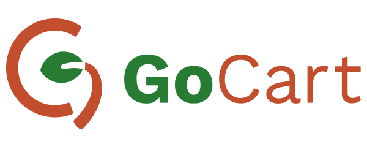

# GoCart

This project is currently a 🚧 **work in progress**.

GoCart is an online grocery shopping app built
with [Jetpack Compose](https://developer.android.com/jetpack/compose).
The goal of this project is to showcase Modern Android Development best practices.

## Screenshots

 

### Light Theme

    

### Dark Theme

    

## Tech Stack

* [Kotlin](https://kotlinlang.org/).
* [Jetpack Compose](https://developer.android.com/jetpack/compose) for the UI.
* [Kotlin Coroutines](https://kotlinlang.org/docs/reference/coroutines/coroutines-guide.html)
* [Architecture Components](https://developer.android.com/topic/libraries/architecture/)
* [Hilt](https://dagger.dev/hilt/) for dependency injection

## Architecture

The app implements
Google's [guide to app architecture](https://developer.android.com/topic/architecture)
