# GoCart

> This project is currently a 🚧 **work in progress**.

GoCart is an online grocery shopping app built
with [Jetpack Compose](https://developer.android.com/jetpack/compose).
The goal of this project is to showcase Modern Android Development best practices.

<a href="https://studio.firebase.google.com/import?url=https%3A%2F%2Fgithub.com%2Fetonotieno%2Fgocart">
  <picture>
    <source
      media="(prefers-color-scheme: dark)"
      srcset="https://cdn.firebasestudio.dev/btn/open_light_32.svg">
    <source
      media="(prefers-color-scheme: light)"
      srcset="https://cdn.firebasestudio.dev/btn/open_dark_32.svg">
    
  </picture>
</a>

## Screenshots

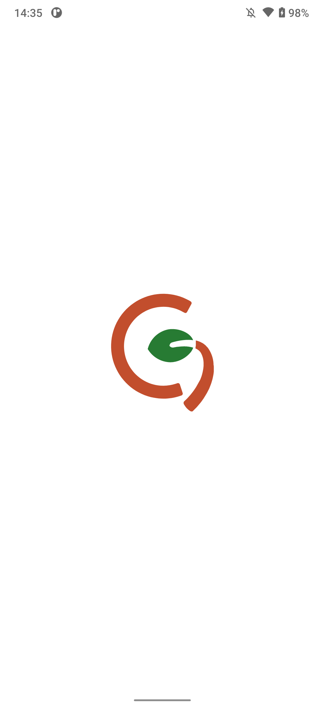 

### Light Theme

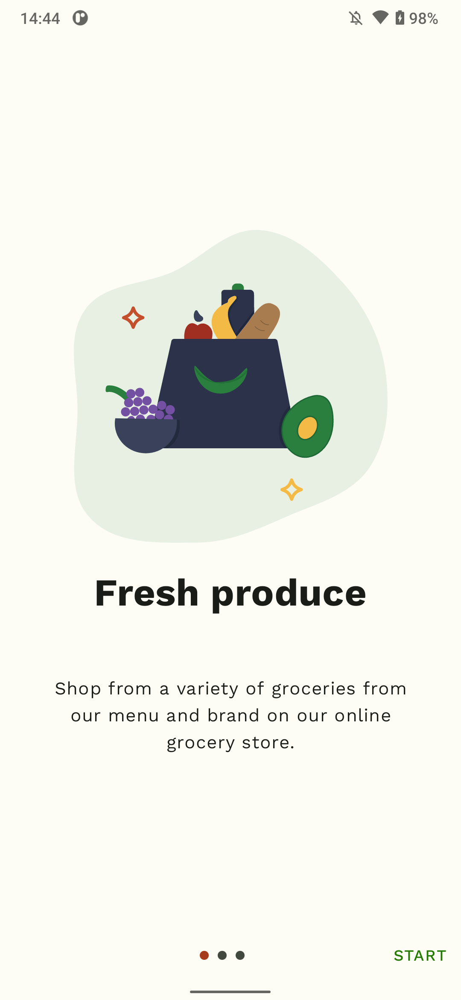 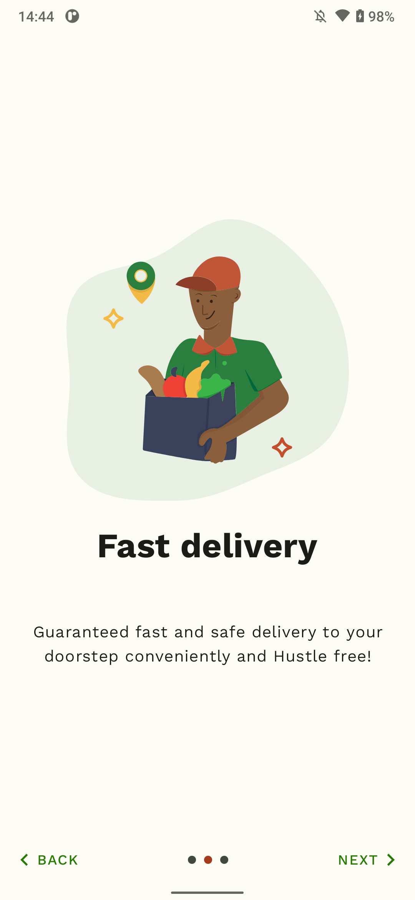 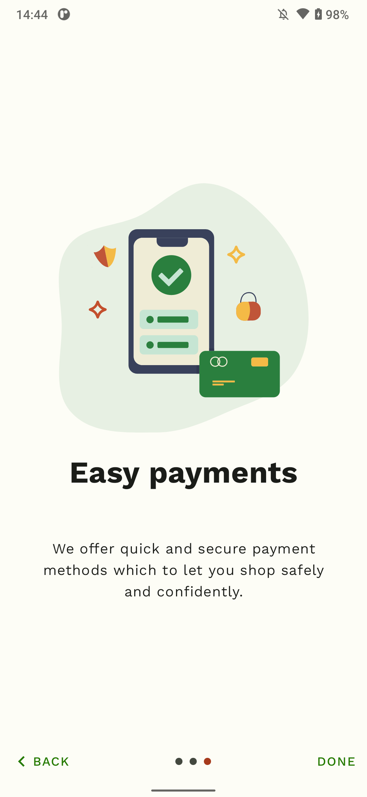 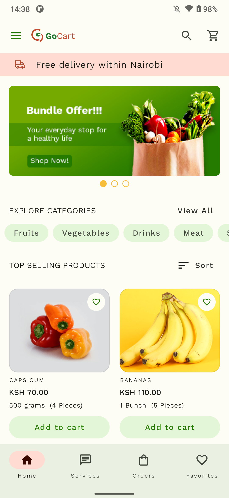 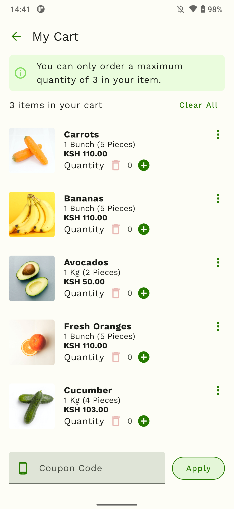

### Dark Theme

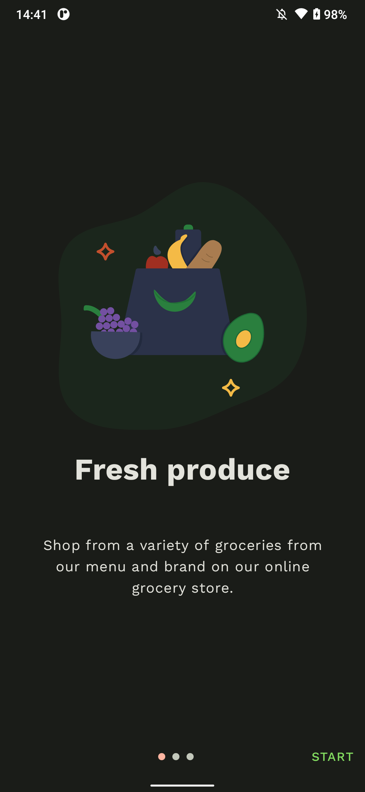 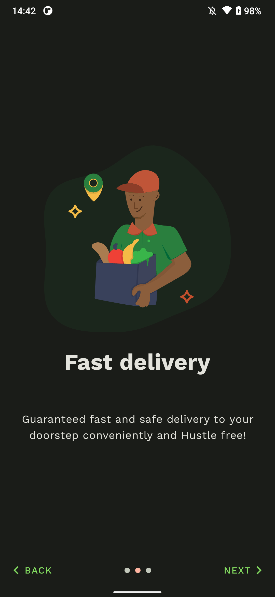 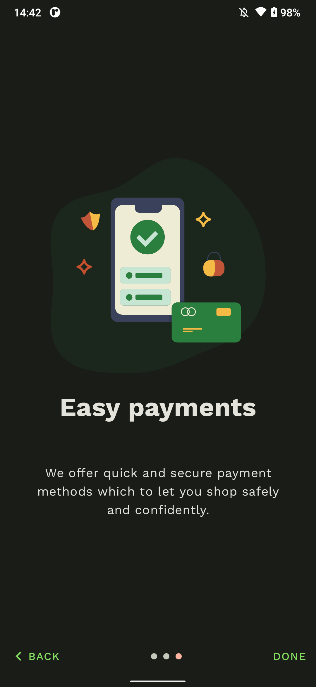 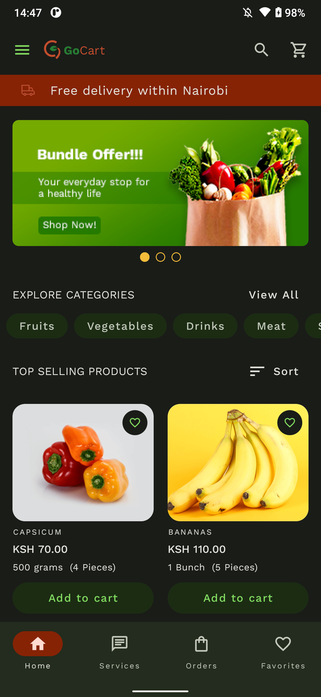 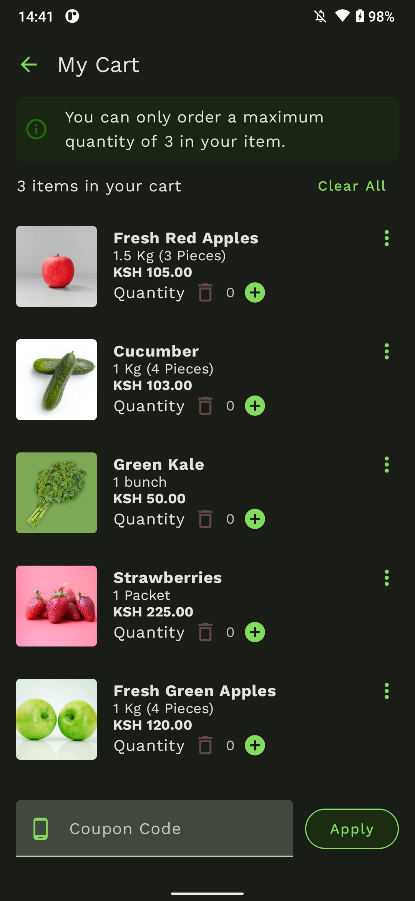

## Release

Download the latest release from
the [GitHub Releases](https://github.com/etonotieno/GoCart/releases/tag/app-release) section
or [download the apk](https://github.com/etonotieno/GoCart/releases/download/app-release/android-release.apk)

## Build and Run GoCart

1. Clone the repository
2. Open the whole project in `Android Studio Jellyfish | 2023.3` or above
3. Sync & Run the `android` configuration

### Requirements

1. JDK 17
2. Android Studio Jellyfish | 2023.3.1+

## Tech Stack

* [Kotlin](https://kotlinlang.org/)
* [Jetpack Compose](https://developer.android.com/jetpack/compose) for the UI
* [Kotlin Coroutines](https://kotlinlang.org/docs/reference/coroutines/coroutines-guide.html)
* [Architecture Components](https://developer.android.com/topic/libraries/architecture/)
* [Hilt](https://dagger.dev/hilt/) for dependency injection

## Architecture

The app implements
Google's [guide to app architecture](https://developer.android.com/topic/architecture)

## Features

- [x] Light and Dark theme
- [x] Dynamic theming
- [x] [Themed app icon](https://developer.android.com/develop/ui/views/launch/icon_design_adaptive) -
  Android 13+
- [ ] Authentication
- [ ] Shopping Cart
- [ ] Wishlist
- [ ] Search for products
- [ ] Order history
- [ ] Order summary
- [ ] Glance widgets
- [ ] Adaptive UI
